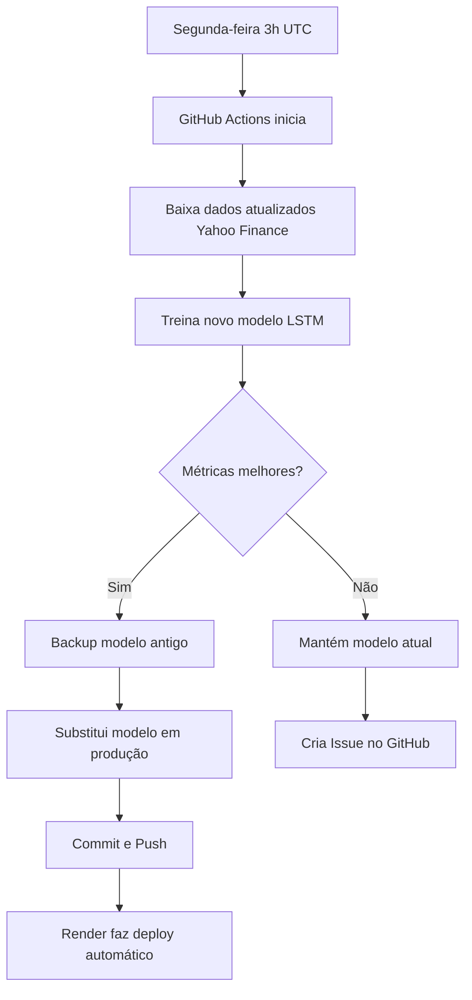

# 🔄 Sistema de Re-treino Automático

**Última atualização:** 02/01/2026 (v2.1)

## 📋 Visão Geral

Sistema automatizado que mantém o modelo LSTM sempre atualizado através de re-treino semanal via **GitHub Actions**.

### Por que é necessário?

- 📉 **Data Drift**: Mercado muda, modelo envelhece
- 🎯 **Precisão**: Dados recentes melhoram previsões
- 🤖 **Automação**: Sem intervenção manual necessária

### ⚠️ Status Atual (v2.1)

**Model Degradation Detectado:**
- **Baseline (Fase 4):** R² = 0.935, MAPE = 1.53%
- **Atual (v2.1):** R² = 0.7757, MAPE = 2.0%

**Recomendação:** Executar re-treino manual para investigar degradação (possível causa: dados Yahoo Finance API v8 diferentes do treinamento original)

---

## 🏗️ Como Funciona

### Fluxo Automático



### Componentes

1. **`scripts/retrain_model.py`**
   - Coleta dados atualizados (5 anos)
   - Treina modelo com mesma arquitetura
   - Compara métricas (MAPE, R²)
   - Faz backup antes de substituir

2. **`.github/workflows/weekly_retrain.yml`**
   - Roda toda segunda-feira às 3h UTC
   - Instala dependências
   - Executa script de re-treino
   - Faz commit do novo modelo
   - Cria issue se falhar

---

## ⚙️ Configuração

### Já Configurado! ✅

O sistema está **pronto para usar** após fazer push. Não precisa configurar nada no GitHub.

### Quando Executa

- 📅 **Automático**: Toda segunda-feira às 3h UTC (0h BRT)
- 🖱️ **Manual**: Via GitHub Actions interface

### Executar Manualmente

1. Acesse: `https://github.com/ArgusPortal/PredictFinance/actions`
2. Clique em "🔄 Re-treino Semanal Automático"
3. Clique em "Run workflow"
4. (Opcional) Marque "Force" para forçar substituição
5. Clique em "Run workflow" verde

---

## 📊 Critérios de Aprovação

O novo modelo **só substitui** o atual se:

### ✅ Critério 1: MAPE
```
MAPE_novo ≤ MAPE_antigo × 1.10
```
*Tolerância de até 10% de piora*

### ✅ Critério 2: R²
```
R²_novo ≥ R²_antigo × 0.95
```
*Tolerância de até 5% de piora*

### Exemplo

```
Modelo Atual:  MAPE=1.53%, R²=0.9351
Modelo Novo:   MAPE=1.65%, R²=0.9320

✅ MAPE: 1.65% ≤ 1.68% (1.53 × 1.10) - APROVADO
✅ R²:   0.9320 ≥ 0.8883 (0.9351 × 0.95) - APROVADO

Resultado: MODELO SUBSTITUÍDO
```

---

## 🔍 Monitoramento

### Ver Execuções

1. Acesse: https://github.com/ArgusPortal/PredictFinance/actions
2. Filtre por "Re-treino Semanal Automático"
3. Veja status (✅ sucesso, ❌ falha)

### Logs Detalhados

Cada execução mostra:
- 📥 Dados coletados (quantidade)
- 🧠 Progresso do treinamento
- 📊 Métricas do novo modelo
- 🔍 Comparação com modelo atual
- ✅ Decisão (substituir ou manter)

### Artefatos Salvos

Cada execução salva por 30 dias:
- `model_metrics.json` - Métricas do novo modelo
- `backups/` - Backup do modelo anterior

---

## 🚨 Tratamento de Erros

### Se Re-treino Falhar

1. **Issue Automático** 🎫
   - GitHub cria issue com detalhes
   - Labels: `automated`, `retrain`, `urgent`
   - Contém link para logs

2. **Modelo Atual Preservado** 🛡️
   - API continua funcionando
   - Nenhum downtime

3. **Notificação** 📧
   - Você recebe email do GitHub
   - Issue aparece no repositório

### Possíveis Causas de Falha

- ❌ Yahoo Finance indisponível
- ❌ Dados insuficientes
- ❌ Timeout (>60min)
- ❌ Memória insuficiente
- ❌ Métricas muito piores

---

## 🛠️ Uso Manual (Local)

### Teste Básico (sem substituir)

```bash
python scripts/retrain_model.py --dry-run
```

- Treina modelo novo
- Mostra métricas
- **NÃO substitui** modelo atual

### Re-treino Real

```bash
python scripts/retrain_model.py
```

- Treina e compara
- Substitui **só se aprovado**

### Forçar Substituição

```bash
python scripts/retrain_model.py --force
```

- Substitui **mesmo se pior**
- Use com cautela!

### Outros Tickers (Experimental)

```bash
python scripts/retrain_model.py --ticker PETR4.SA --years 3
```

---

## 📂 Estrutura de Arquivos

```
PredictFinance/
├── scripts/
│   └── retrain_model.py           # Script principal
├── .github/workflows/
│   └── weekly_retrain.yml         # GitHub Actions config
├── models/
│   ├── lstm_model_best.h5         # Modelo em produção
│   ├── scaler.pkl                 # Scaler do modelo
│   ├── model_metrics.json         # Métricas atuais
│   └── backups/                   # Backups automáticos
│       ├── lstm_model_20251120.h5
│       └── scaler_20251120.pkl
└── data/
    ├── raw/
    │   └── B3SA3.SA_atualizado.csv
    └── processed/
        ├── X_train.npy
        └── ...
```

---

## 💾 Backups

### Automático

Cada re-treino cria backup:
```
models/backups/lstm_model_YYYYMMDD_HHMMSS.h5
models/backups/scaler_YYYYMMDD_HHMMSS.pkl
```

### Restaurar Backup

```bash
# Listar backups
ls -lh models/backups/

# Restaurar específico
cp models/backups/lstm_model_20251120_030500.h5 models/lstm_model_best.h5
cp models/backups/scaler_20251120_030500.pkl models/scaler.pkl

# Commit
git add models/
git commit -m "Restaurar modelo do backup 20251120"
git push
```

---

## 🎯 Métricas e Histórico

### Ver Métricas Atuais

```bash
cat models/model_metrics.json
```

```json
{
  "MAE": 0.2034,
  "RMSE": 0.2615,
  "MAPE": 1.53,
  "R2": 0.9351,
  "timestamp": "2025-11-20T03:15:42"
}
```

### Histórico de Re-treinos

Acessar commits do GitHub:
```bash
git log --grep="Auto-retrain" --oneline
```

Exemplo:
```
e034c8d 🤖 Auto-retrain: Modelo atualizado - 2025-11-20 03:15:00 UTC
a123b45 🤖 Auto-retrain: Modelo atualizado - 2025-11-13 03:10:00 UTC
```

---

## 🔧 Ajustar Frequência

### Mudar Horário

Edite `.github/workflows/weekly_retrain.yml`:

```yaml
schedule:
  - cron: '0 3 * * 1'  # Segunda 3h UTC
```

Exemplos:
```yaml
- cron: '0 2 * * 1'     # Segunda 2h UTC (23h domingo BRT)
- cron: '0 0 * * *'     # Todo dia à meia-noite UTC
- cron: '0 0 * * 0'     # Todo domingo à meia-noite UTC
- cron: '0 0 1 * *'     # Primeiro dia do mês
```

### Ajustar Tolerâncias

Edite `scripts/retrain_model.py`:

```python
def comparar_modelos(metricas_antigas, metricas_novas):
    # Tolerância de 10% piora no MAPE
    mape_ok = mape_new <= mape_old * 1.1  # <- Mudar aqui
    
    # Tolerância de 5% piora no R2
    r2_ok = r2_new >= r2_old * 0.95  # <- Mudar aqui
```

---

## 🆘 Troubleshooting

### Problema: "No module named 'src'"

**Solução**: Certifique-se que estrutura do projeto está correta
```bash
ls -la src/
# Deve ter: data_collection.py, model_training.py, etc.
```

### Problema: Timeout no GitHub Actions

**Solução**: Aumentar timeout em `weekly_retrain.yml`
```yaml
timeout-minutes: 120  # 2 horas
```

### Problema: Yahoo Finance bloqueando

**Solução**: Script já tem retry automático. Se persistir, aguarde algumas horas.

### Problema: Memória insuficiente

**Solução**: Reduzir batch_size ou epochs no script
```python
treinar_modelo(..., epochs=30, batch_size=16)
```

---

## 📈 Melhorias Futuras

- [ ] Notificação via Slack/Discord
- [ ] Dashboard de métricas históricas
- [ ] A/B testing de modelos
- [ ] Ensemble de múltiplos modelos
- [ ] Re-treino adaptativo (frequência variável)

---

## 📞 Suporte

**Problemas?**
1. Verificar logs: https://github.com/ArgusPortal/PredictFinance/actions
2. Ver issues automáticos criados
3. Executar localmente: `python scripts/retrain_model.py --dry-run`

**Dúvidas?**
- Criar issue no GitHub
- Ver documentação do projeto

---

## 📄 Resumo Executivo

✅ **O que faz**: Re-treina modelo LSTM toda semana automaticamente

✅ **Por que**: Mantém modelo atualizado com dados recentes

✅ **Como**: GitHub Actions executa script Python

✅ **Quando**: Segunda-feira 3h UTC (automático)

✅ **Garantia**: Só substitui se métricas aprovarem

✅ **Segurança**: Backup automático + rollback fácil

✅ **Zero custo**: GitHub Actions grátis (2000 min/mês)

✅ **Zero manutenção**: Totalmente automático

---

**Status**: 🟢 Ativo e Funcionando

**Última atualização**: 2025-11-20
